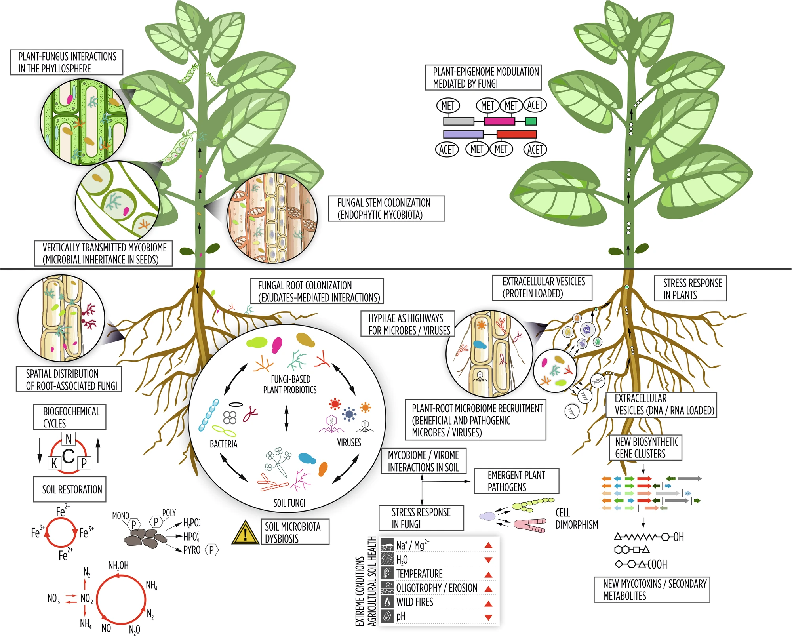
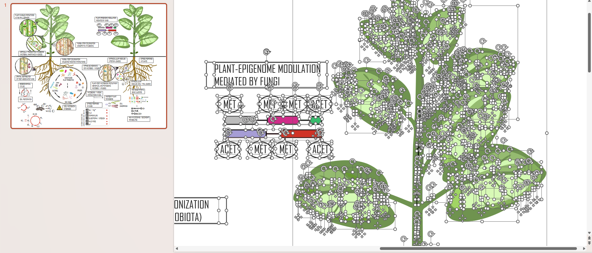
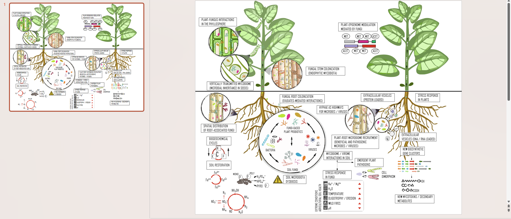

# Norman-Skill

你好，我是 **N同学(Norman)**，一名清华大学在读博士生。  
Hi, I'm **Norman (N同学)**, a PhD student at Tsinghua University.

科研过程中，我经常会遇到论文图片难编辑、PPT 制作耗时、科研工作流重复繁琐等问题。因此，我把自己日常使用和整理的一些方法逐渐做成了 **Norman-Skill**。

During my research, I often encounter time-consuming tasks such as editing figures from papers, preparing presentation slides, and repeating similar research workflows. To make these tasks easier, I started organizing the methods and tools I use in my daily research into **Norman-Skill**.

这里会持续更新科研制图、论文图片处理、PPT、AI 辅助科研等实用 Skill，希望让一些原本需要反复手动完成的工作变得更简单、更高效。

This repository will continuously provide practical Skills for scientific visualization, figure processing, PowerPoint creation, AI-assisted research, and other research workflows — making repetitive tasks simpler and more efficient.

如果这些 Skill 对你有帮助，欢迎 ⭐ Star 本项目。  
If you find these Skills useful, feel free to ⭐ **Star this repository**.

---

## 👋 关于我 | About Me

- 🎓 **清华大学在读博士生 | PhD Student at Tsinghua University**
- 📕 **小红书 | Xiaohongshu:** N同学
- 🎵 **抖音 | Douyin:** 耐心的N同学
- 📺 **B站 | Bilibili:** 耐心的N同学

平时主要分享：  
I mainly share content about:

- 科研效率工具 | Research productivity tools
- AI 辅助科研 | AI-assisted research
- 论文写作与科研绘图 | Academic writing & scientific visualization
- PPT 制作与优化 | Presentation design & optimization
- 数据分析与科研工作流 | Data analysis & research workflows
- 博士阶段的一些学习与科研经验 | PhD study & research experience

---

# 🧩 Norman-Skill

**Norman-Skill** 是一个持续更新的实用 Skill 项目。  
**Norman-Skill** is a continuously updated collection of practical Skills for research.

项目会围绕真实科研场景，逐步整理和发布可以直接使用的 Skill，让 AI 更好地参与论文制图、PPT、图像处理、科研写作以及其他科研工作流。

The project focuses on real-world research scenarios and provides reusable Skills that allow AI to participate more effectively in scientific visualization, presentations, image processing, academic writing, and other research workflows.

目前已经上线的 Skill：  
Currently available Skill:

### 下载与安装 | Download and install

完整的 Windows / Mac 本地技能位于 [norman-fig2ppt/](norman-fig2ppt/)，支持 Windows x64、Mac Apple Silicon 和 Mac Intel。英文技能指令、中英双语说明与全部运行组件均包含在内。

The complete local skill is available in [norman-fig2ppt/](norman-fig2ppt/), with bundled engines for Windows x64, Mac Apple Silicon, and Mac Intel, English skill instructions, and a bilingual README.

通过仓库的 **Code → Download ZIP** 下载并解压后，将其中完整的 `norman-fig2ppt` 文件夹复制到 Codex 的技能目录。不要只下载 `SKILL.md` 或单个可执行文件。

Download this repository using **Code → Download ZIP**, extract it, and copy the complete `norman-fig2ppt` folder into your Codex skills directory. Keep all bundled files together.

详细安装路径、Quick / Advanced 模式、平台要求及验证范围：[中英使用说明](norman-fig2ppt/README.md)。

For installation paths, Quick / Advanced modes, platform requirements, and validation scope, see the [English / Chinese guide](norman-fig2ppt/README.md).

## 🎨 论文图片矢量化 | Paper Figure Vectorization

将论文中的复杂图片转换为：

Convert complex figures from research papers into:

> **PowerPoint 中可编辑的矢量图形**  
> **Editable vector graphics in PowerPoint**

转换后的文字、线条、箭头、图标以及其他图形元素，都可以在 PowerPoint 中进一步修改、移动和重新排版。

Text, lines, arrows, icons, and other graphical elements can be further edited, moved, resized, and rearranged directly in PowerPoint.

适用于：  
Suitable for:

- 论文汇报 | Research presentations
- 文献讲解 | Paper presentations
- 科研绘图 | Scientific visualization
- PPT 制作 | PowerPoint creation
- Figure 重构 | Figure reconstruction
- 图形二次编辑 | Figure editing and reuse

---

## 🔍 效果展示 | Demo

### 原始图片 → 可编辑矢量图  
### Original Figure → Editable Vector Graphics

| 原始论文图片 Original Figure | Norman-Skill 矢量化结果 Vectorized Result |
| :---: | :---: |
|  |  |
| **原始论文图片** Original paper figure | **PowerPoint 中可编辑的矢量元素** Editable vector elements in PowerPoint |

---

## ✨ 矢量化后的编辑效果 | Editable Results

  

  <em>
  图中的文字、线条、箭头和图形元素均可在 PowerPoint 中进一步编辑。 
  Text, lines, arrows, and graphical elements can all be further edited in PowerPoint.
  </em>

---

## 🚀 为什么做 Norman-Skill？ | Why Norman-Skill?

很多科研工作其实并不难，但非常耗时间。  
Many research tasks are not technically difficult — they are simply repetitive and time-consuming.

例如：  
For example:

- 一张论文 Figure 想重新编辑，却只有 PNG；  
  You want to edit a figure from a paper, but only have a PNG image.

- 一张复杂流程图想复用，却需要重新画一遍；  
  You want to reuse a complex diagram, but have to redraw everything from scratch.

- PPT 中的大量元素需要手动调整；  
  Many elements in presentation slides need to be adjusted manually.

- 同样的科研任务需要反复操作；  
  The same research workflow needs to be repeated again and again.

- AI 能完成任务，但每次都需要重新写提示词和流程。  
  AI can help, but prompts and workflows often have to be recreated every time.

因此，我希望把这些重复性的工作逐渐整理成 Skill。

That is why I want to gradually turn these repetitive workflows into reusable Skills.

目标很简单：  
The goal is simple:

> **让 AI 真正进入科研工作流，而不只是回答问题。**  
> **Bring AI into real research workflows — not just use it to answer questions.**

---

## 🛠️ 后续会更新什么？ | What's Coming Next?

后续会持续更新更多科研相关 Skill，包括但不限于：  
More research-related Skills will be added, including but not limited to:

- 📊 论文图片矢量化  
  Paper figure vectorization

- 🎨 科研绘图与美化  
  Scientific visualization and figure enhancement

- 📑 PPT 自动生成与优化  
  Automated presentation generation and optimization

- 🧩 论文 Figure 拆解与重构  
  Paper figure decomposition and reconstruction

- 🖼️ 图片元素提取与编辑  
  Image element extraction and editing

- ✍️ 论文写作辅助  
  Academic writing assistance

- 📚 文献整理与阅读  
  Literature organization and reading

- 🤖 AI 辅助科研工作流  
  AI-assisted research workflows

- 💻 数据分析与代码辅助  
  Data analysis and coding assistance

- 🛠️ 更多提高科研效率的小工具  
  More tools for improving research productivity

更多 Skill 会陆续更新。  
More Skills are coming soon.

---

# 📱 关注我 | Follow Me

如果你对科研工具、AI Skill、论文写作、科研绘图以及博士阶段的学习与科研经验感兴趣，可以在下面的平台找到我。

If you're interested in research tools, AI Skills, academic writing, scientific visualization, or PhD research and study experiences, you can find me on the following platforms.

<table>
  <tr>
    <td align="center" width="220">
      <strong>📕 小红书 Xiaohongshu</strong>
        
      
        
      <strong>N同学</strong>
    </td>
    <td align="center" width="220">
      <strong>🎵 抖音 Douyin</strong>
        
      
        
      <strong>耐心的N同学</strong>
    </td>
    <td align="center" width="220">
      <strong>📺 B站 Bilibili</strong>
        
      
        
      <strong>耐心的N同学</strong>
    </td>
  </tr>
</table>

---

## ⭐ Support

如果 Norman-Skill 对你的科研或学习有所帮助，欢迎：  
If Norman-Skill helps with your research or study, feel free to:

- ⭐ **Star 本项目 | Star this repository**
- 🍴 **Fork 并尝试自己的工作流 | Fork it and build your own workflow**
- 📢 **分享给有需要的同学 | Share it with others**
- 📱 **关注我的小红书 / 抖音 / B站 | Follow me on Xiaohongshu / Douyin / Bilibili**

  <strong>
  更多 Skill 持续更新中 🚀 
  More Skills are coming soon 🚀
  </strong>

